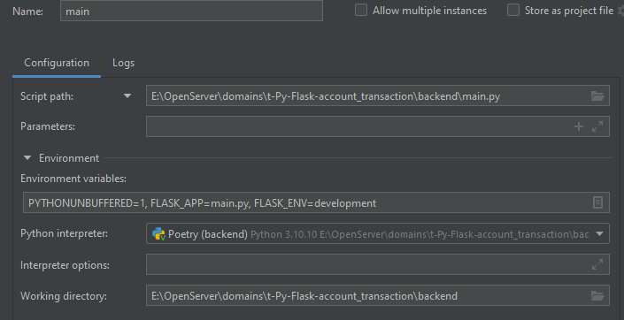

# Транзакция
Описание ниже расчитано, что вы знаете как клонировать данные из репозитория, \
легко устанавливаете зависимости, у вас настроен `radis` и знаете , \
что такое `сельдерей` .

## Примечание ("прочитать перед употреблением")
Учитывая, что это лишь тест. Цель теста оценить опыт претендента на должность\
решил сделать задачи с пометкой "необязательный". 

Приложение имеет полноценную базу данных (БД).\
Работа происходит с теми же словарями/json, в некотором роде.\

В некоторых частях логики данного app встроено логирование, так как запуск \
в debug режиме не даёт результатов.\


### Error
К сожалению не удалось реалезовать :-( задачи с пометкой "необязательный" :( \ 
2+ дня ушло на [поиск ядра ошибки](#теперь-об-ошибке), но не нашел. 

Надеюсь вы укажите на ядро в независимости от принятого решения.

### База данных
\
Сама БД:
- написана на `sqlalchemy`;
- создавалась на момент разработки в `postgraSQL`.

Первичный и каждые последующие запуски автоматически запускают \
файл `project/models.py` и проверку на наличие базы и таблиц. \
Сама связь c `postgreSQL` реализована через `project/models_more/postcresbase.py`.

Вам достаточно лишь переписать соединение под свой тип БД в строках\
```text
 connection = psycopg2.connect(
        user=f"{SETTING_POSTGRES_USER}",
        password=f"{SETTING_POSTGRES_PASSWORD}",
        host=f"{SETTING_POSTGRES_HOST}",
        port=f"{SETTING_POSTGRES_PORT}",
    )
```
из файла `project/models_more/postcresbase.py`.

Всё остальное через `sqlalchemy`.

## Stack
```text
[tool.poetry.dependencies]
python = "^3.10"
python-dotenv = "^1.0.1"
pytest-cov = "^6.0.0"
pytest-asyncio = "^0.24.0"
flower = "^2.0.1"


[tool.poetry.group.dev.dependencies]
asyncio = "^3.4.3"
autohooks = "^24.2.0"
flake8 = "^7.1.1"
pre-commit = "^3.8.0"
celery = {extras = ["librabbitmq"], version = "^5.4.0"}
markdown = "^3.7"
pylint = "^3.3.1"
isort = "^5.13.2"
black = "^24.8.0"
psycopg2 = "2.9.10"
sqlalchemy = "2.0.36"
flask = {extras = ["async"], version = "^3.1.0"}
wtforms = "^3.2.1"
flask-sqlalchemy = "^3.1.1"
flask-login = "^0.6.3"
flask-bootstrap = "^3.3.7.1"
postgres = "^4.0"
psycopg2-binary = "^2.9.10"
flask-jwt-extended = "^4.7.1"
flask-wtf = "^1.2.2"
flask-admin = {extras = ["export", "images", "s3", "sqlalchemy", "translation"], version = "^1.6.1"}
flask-swagger-ui = "^4.11.1"
flask-bcrypt = "^1.0.1"
flask-redis = "^0.4.0"
```
Тестирование не проводилось.

## .env
```text
SETTING_POSTGRES_DB=< dbname_for_your_db >
SETTING_POSTGRES_USER=< login_for_your_db >
SETTING_POSTGRES_PASSWORD=< password_for_your_db >
SETTING_POSTGRES_HOST=localhost
SETTING_POSTGRES_PORT=5432
HOST_TO_BACKEND=localhost
PORT_TO_BACKEND=5000
PROTOCOL_TO_BACKEND=http
SECRET_KEY= < secret_key_of_your_app >
REDIS_URL=redis://localhost:6379/0

```
## Команды
Вы знаете, что такое `pip` & `poetry` и умеете их устанавливать.

### Установка зависимостей
```text
poetry install
# or
pip install requirements.txt
```

### Старт приложения
```text
python main.py
```

### Создать пользователя п.2
Команда из файла `project/apps.py`. 
```text
flask create_admin
```

#### Запуск сельдерея
```text
celery -A project.celeries.celery_tasks.sta tus_transaction_task worker --loglevel=info --pool=solo

```
*Note: `--pool=solo` если ваша OS есть windows.*

#### Для работы через PyCharm
```text
Env. Var.: PYTHONUNBUFFERED=1,  PYTHONTRACEMALLOC=1, PWDEBUG=1
```


## Описание
Запуская приложение, в 4 этапа:
1. Запуск app.
2. Создаем рандомного администратора через команду из консоли. 
3. Запуск `Celery`.
4. Делаем перезапуск app.

### `Flask` и `Celery`
Запуск `Celery` должен вывести , в консоле следующие данные \


`Flask` интегрирован с `Celery` поэтому логи из `Flask` будут видны в `Celery`.\
Логирование есть файл `project/logs.py`.\

### БД п.1
При запуске отрабатываются файлы `project/models.py` и `project/models_more`.

### Админ панель п.3
Доступна по `/admin`.\
Изначально, задумал делать frontend с использованием `webpack` и самописные \
шаблоны от `flask`/`django` с использование `TypeScript`. \
Пример `project/templates` & `project/static`. \
Реализация CRUD/API тоже через front на `TypeScript`.\ 
После решил изучить `flask-admin`. 

Админ панель `project/admins.py` & `project/forms` & `project/templates/index.html`.\
 \
На данный момент в админ панели работает интерфейс:
- создать;
- редактировать;
- удалить данные из `User`, `Transaction`, `User transaction` - частично (ниже).


### API
API в файле `project/views.py` реализованы п.: 4,5,6. 

### Celery п.4
`Celery` это файлы:
- `project/celeries`;
- метод `pending` класса `Bank` из `project/transactions.py` .

Сырой код: `pending`и в задаче `check_pending_transaction` ниже\
строки 31 из-за ошибки.

#### Теперь об ошибке
Файл `project/models.py` содержит сессию для работы с БД. \
В работе с БД через API всё работает и не только. \
Но, тут метод `pending` класса `Bank` из `project/transactions.py` для Celery.

При попытке создать связь с БД `session.quary(Users)...` получаю \
ошибку `'Session' object is not callable`.\
Если смотреть в debug режиме , чтение просто `session` возвращает \
объект. Но, связь с БД (в теле Celery) возвращает ошибку. При этом, \
связь интерфейса (админ панели) и БД остается рабочей (файл `project/admins.py`). \
Note: синтаксис кода исправлен. Логика кода не исправлена (через 3 дня \
вернусь к задаче).

#### `User transaction`

Форма `project/forms/user_transactions_forms/edit_form.py` содержит поля:
1. `trasaction_id` - выбрать данные из списка.
2. `user_id`- выбрать данные из списка.
3. `datetime` - автоматически получаем данные на момент события.

Списки (`User transaction` п.1 и 2 ) через `trasaction_id.choices=` должны\
получать списки через `self.переменную`.\
Сама же `self.переменная` через `def __init__` должна была получать \
списки из \
 \
Функции `bank.get_user_all_`&`_get_transaction_all` (удалены) в теле своем \
содержали ту же самую `session` и получали ту же \
ошибку `'Session' object is not callable`.

*Note: Попытки прописать образование `session` напрямую в логике*  \
*образования ошибки `'Session' object is not callable` изменений не дает*.


*P.S.: Надеюсь укажите на ядро ошибки.* 

-- --
Note: синтаксис кода исправлен. Логика кода не исправлена (через 3 дня \
вернусь к задаче) (19.12.24).